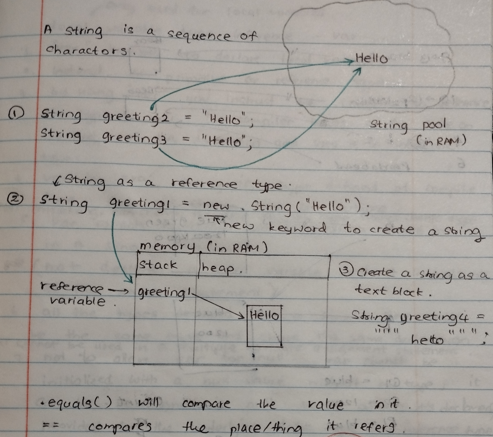
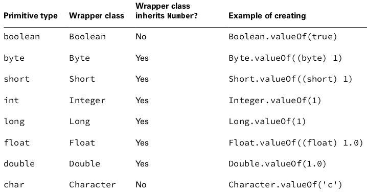
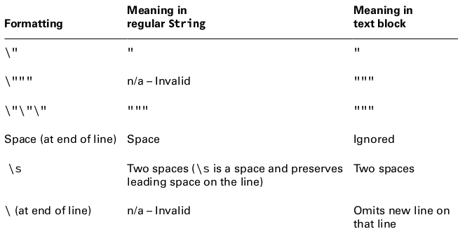
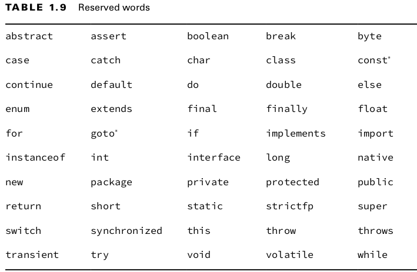

# Chapter 1

- javac: converts .java source files into .class bytecode
- java: Executes the program
- jar: Packages files together
- javadoc: Generates documentation

## 1.1. Class structure

- class: basic building block
- object: a runtime instance of a class in memory
- reference: a variable that points to an object
- members of a class:
  - methods: functions or procedures, operate on program's state
  - fields: variables, holds the state of the program
keyword: a word with special meaning in java

- to compile and have .class files inside build folder:
```shell
javac -d build Animal.java 
```
- to run the compiled code in build folder: (all three options do the same thing)
```shell
java -cp build Animal
```
```shell
java -classpath build Animal
```
```shell
java --class-path build Animal
```

Classes and Source Files
[`Demo.java`](1_class_structure/Demo.java)
<br>Fields and methods
[`Animal.java`](1_class_structure/Animal.java)
<br>Comments
[`Comment.java`](1_class_structure/Comment.java)

## 1.2. Main method

- main() method must be **public**
- main() method must have a **void** return type.
- main() method must be **static**
- canonical main() method signature
    `public static void main(String[] args)` 
- alternate form of main() method signature with the redundant **final** 
    `public static final void main(String[] args)`

<br>Writing a main() method
[`Zoo.java`](2_main_method/Zoo.java)

To run with arguments passed into main method:
```shell
java Zoo elephant rabbit
```
```shell
java -cp build Zoo elephant rabbit
```
```shell
java -cp build Zoo "african elephant" rabbit
```

- Single-File Source code: skipping explicit compilation step, useful for small programs, one file.
```shell
java Zoo.java elephant Zoo
```
```shell
java Zoo.java Zoo
```

## 1.3. Packages
### 1.3.1. Using Java Packages
- import from packages to use a java class
[`NumberPickerError.java`](3_packages/NumberPickerError.java)
[`NumberPickerCorrect.java`](3_packages/NumberPickerCorrect.java) <br>
- \* is the wildcard that matches all classes in a package
[`NumberPickerWildcard`](3_packages/NumberPickerWildcard.java) <br>
- The import statement imports only classes directly under the package.
[`AtomicIntegerDemo`](3_packages/AtomicIntegerDemo.java) <br>
- Redundant imports
[`NumberPickerRedundantImports`](3_packages/NumberPickerRedundantImports.java)
[`InputImportsRedundantImports`](3_packages/InputImportsRedundantImports.java)<br>
- Naming conflicts
[`NamingConflicts`](3_packages/NamingConflicts.java)

### 1.3.2. Create a new package
ClassA.java in packagea [`ClassA`](3_packages/packagea/ClassA.java)<br>
ClassB.java in packageb [`ClassB`](3_packages/packageb/ClassB.java)
- Compile both at once
```shell
javac packagea/ClassA.java packageb/ClassB.java
```
- Which will result;<br>
ClassA.class in packagea [`ClassA`](3_packages/packagea/ClassA.class)<br>
ClassB.class in packageb [`ClassB`](3_packages/packageb/ClassB.class)

- to run the program
```shell
java packageb.ClassB
```

- Compiling with wildcard: use \* to include all java files in a directory, if you have a lot of files in a package
```shell
javac packagea/*.java packageb/*.java
``` 

- Compiling to another directory: into build directory
```shell
javac -d build packagea/ClassA.java packageb/ClassB.java
```
- Which will result;<br>
ClassA.class in build/packagea [`ClassA`](3_packages/build/packagea/ClassA.class)<br>
ClassB.class in build/packageb [`ClassB`](3_packages/build/packageb/ClassB.class)<br>

- to run the program: can use one of the three options
```shell
java -cp build packageb.ClassB
```
```shell
java -classpath build packageb.ClassB
```
```shell
java --class-path build packageb.ClassB
```

### 1.3.3. Compiling with JAR file.
[`LotteryDraw`](3_packages/jar_example/LotteryLib/src/com/postcode/draw/LotteryDraw.java)<br>
[`Main`](3_packages/jar_example/LotteryMain/src/com/postcode/main/Main.java)<br>
[`postcodes`](3_packages/jar_example/postcodes.txt)<br>
- first compile LotteryDraw.java
- you are inside folder: chapter_1_Building_blocks/3_packages/jar_example/LotteryLib/src
```shell
javac -d ../build com/postcode/draw/LotteryDraw.java
```
- create LotteryDraw.jar in current folder
- you are inside folder: chapter_1_Building_blocks/3_packages/jar_example/LotteryLib/build
```shell
jar -cvf LotteryLib.jar com/postcode/draw/*.class
```
- compile Main.java with LotteryLib.jar
- you are inside folder: chapter_1_Building_blocks/3_packages/jar_example/LotteryMain/src
```shell
javac -cp /home/vijani/Documents/kata/OCP-17-Practice/chapter_1_Building_blocks/3_packages/jar_example/LotteryLib/build/LotteryLib.jar -d ../build com/postcode/main/Main.java
```
- run Main with LotteryLib.jar
- you are inside folder: chapter_1_Building_blocks/3_packages/jar_example/LotteryMain/build
```shell
java -cp .:/home/vijani/Documents/kata/OCP-17-Practice/chapter_1_Building_blocks/3_packages/jar_example/LotteryLib/build/LotteryLib.jar com/postcode/main/Main
```

Note: (here, : is used to separate different class paths. If you want to consider .jar files in multiple class paths, you can use : to put them into class path. And a . (dot) means the current folder. It says to consider the Main class in the current folder to run)
<br>

### 1.3.4. Ordering elements in a class

- Package declaration
- import statements
- Top-level type declaration: public class A --> this is required
- Field declarations
- Mathod declarations

[`Meerkat.java`](3_packages/ordering-elements/Meerkat.java)

## 1.4. Creating objects

### 1.4.1. Calling Constructors
- create an instance of a class, calling constructor
```java
Park p = new Park();
```
- Constructor name matches the class name
- Constructor has no return type
```java
public class Chick {
  public Chick() {
    System.out.println("in constructor");
  }
}
```
```java
public class Chick {
  public void Chick() {} // NOT A CONSTRUCTOR
}
```
- compiler will supply a default constructor

- initialize fields: by using constructor or initialize on line 
[`Chicken.java`](4_creating_objects/com/farm/Chicken.java)
<br>

### 1.4.2. Reading and writing member fields
- Can read and write instance varables directly from the caller: main() method
[`Swan.java`](4_creating_objects/com/farm/Swan.java)

- Can read values of already initialized fields on a line initializing a new field
[`Name.java`](4_creating_objects/com/farm/Name.java)

### 1.4.3. Executing instance initializer blocks
- code block: code inside braces {}
- code blocks inside a method are run when method is called
- code blocks appear outside a method: instance initializers
[`Bird.java`](4_creating_objects/com/farm/Bird.java)

### 1.4.4. Order of initialization
- execute order: on line initialize fields, run instance initializer, run constructor, run main method
[`Chick.java`](4_creating_objects/com/farm/Chick.java)
[`Egg.java`](4_creating_objects/com/farm/Egg.java)
```shell
4_creating_objects/com/farm$ javac -d ../../build Egg.java
4_creating_objects/com/farm$ java -cp ../../build com.farm.Egg 
```
- order matters: can't refer to a variable before it has been defined
```java
{ System.out.println(name); } // DOES NOT COMPILE
private String name = "Fluffy";
```

## 1.5. Data types

### 1.5.1. Primitive types
| Keyword |          Type         | Min val | Max val  | Default val | Example |
| ------- | --------------------- | ------- | -------- | ----------- | ------- |
| boolean | true or false         |     n/a |      n/a |    false    |   true  |
| byte    | 8-bit integral value  |    -2^7 |  2^7 - 1 |      0      |    123  |
| short   | 16-bit integral value |   -2^15 | 2^15 - 1 |      0      |    123  |
| int     | 32-bit integral value |   -2^31 | 2^32 - 1 |      0      |    123  |
| long    | 64-bit integral value |   -2^63 | 2^63 - 1 |      0L     |    123L |
| float   | 32-bit floatig-point  |     n/a |      n/a |      0.0f   | 123.45f |
| double  | 64-bit floating point |     n/a |      n/a |      0.0    | 123.456 |
| char    | 16-bit unicode value  |       0 | 2^16 - 1 |    \u0000   |    'a'  |

[`PrimitiveType.java`](5_data_types/PrimitiveType.java)
- All numeric types are signed and reverse one bit to cover a negative range
- short and char: both are integral types with 16-bit size. short is signed, char is unsigned include 0. Can cast to one another.
- hold values in memory when the variable is allocated.
- has lowecase type names
- primitives do not have methods declared on them
- cannot assign null

#### 1.5.1.1. Literals

[`Literals.java`](5_data_types/Literals.java)

### 1.5.2. Reference types

- refers to an object
- hold a reference **points** to an object by storing the memory address of where the object is created.
- ex: String is an object, not a primitive type
- A value is assigned into a reference in one of two ways:
  1. to aother object of same type or compatible type
  2. to a new object using new keyword
- can be used to call methods, assuming  the reference is not null.
- can be assigned null 

[`ReferenceType.java`](5_data_types/ReferenceType.java)

  

- if you don't know the value of an int and want to assign it to null? You can use numeric wrapper class, Integer instead of int.


### 1.5.3. Wrapper Classes

- each primitive type has a wrapper class, which is an object type that corresponds to the primitive.
[`Wrapper.java`](5_data_types/Wrapper.java)


More about autoboxing unboxing >> [`Chapter_5`](../chapter_5_Methods/)

### 1.5.4. Text Blocks

[`TextBlock.java`](5_data_types/TextBlock.java)



## 1.6. Variables

### 1.6.1. Declaring variables

- Variable  : piece of memory that stores data
- initializing a variable : giving a variable a value
- Identifier : name of a variable, method, class, interface or package
- rules of a legal identifier:
  1. Identifiers must begin with a letter, a currency symbol, or a _ symbol. Currency symbols
include dollar ($), yuan (¥), euro (€), and so on.
  2. Identifiers can include numbers but not start with them.
  3. A single underscore _ is not allowed as an identifier.
  4. You cannot use the same name as a Java reserved word. 
  5. Cannot use literal values: true, false, null
  6. Cannot use contextual keywords: module
  A reserved word is a special word that Java has held aside so that you are not allowed to use it as identifier. Remember that Java is case sensitive, so you can use versions of the keywords that only differ in case. 



- camalCase and snake_case

[`Identifier.java`](6_declaring_variables/Identifier.java)

#### 1.6.1.1. Declaring Multiple Variables
[`Multiple1.java`](6_declaring_variables/Multiple1.java)
[`Multiple2.java`](6_declaring_variables/Multiple2.java)

### 1.6.2. Initializing variables

#### 1.6.2.1. Local, Instance, Class variables

- Local variable is a variable defined within a constructor, method, or initializer block.
- Final local variables and Final local variable reference cannot be modified.
- Local variables do not have a default value and must be initialized before use.

[`LocalVariable.java`](6_declaring_variables/LocalVariable.java)

- Variables passed to a constructor or method are called constructor parameters or method
parameters, respectively. These parameters are like local variables that have been pre-­
initialized.

- An instance variable, often called a field, is a value defined within a specific instance of
an object.
  ex: Person class with an instance variable name of type String.
      Each instance of the class would have its own value for name, such as Elysia or Sarah.
      Two instances could have the same value for name, but changing the value for one does not
      modify the other.

- a class variable is one that is defined on the class level and shared among all instances of the class. 
- It can even be publicly accessible to classes outside the class and doesn’t require an instance to use.
- a variable is a class variable because it has the keyword static before it.

- Instance and class variables do not require you to initialize them. As soon as you declare
these variables, they are given a default value.

#### 1.6.2.2. Inferring the Type with var

- using the keyword **var** instead of the type when declaring local variables under certain conditions. 
- To use this feature, you just type var instead of the primitive or reference type.
- The formal name of this feature is **local variable type inference**.
- type inference: When you type var, you are instructing the compiler to determine the type for you.


[`VarKeyword.java`](6_declaring_variables/VarKeyword.java)
[`Var.java`](6_declaring_variables/Var.java)

### 1.6.3. Managing variable scope

- Local variables: In scope from declaration to the end of the block
- Method parameters: In scope for the duration of the method
- Instance variables: In scope from declaration until the object is eligible for garbage collection
- Class variables: In scope from declaration until the program ends

[`Scope.java`](6_declaring_variables/Scope.java)
[`Mouse.java`](6_declaring_variables/Mouse.java)

## 1.7. Destroying Objects

## 1.8. Questions

### 1.8.1. Review Questions

- Q1
[`Q1MainMethod.java`](2_main_method/Questions/Q1MainMethod.java)
- Q2
[`Rabbit.java`](3_packages/Questions/Rabbit.java)
- Q3
[`Bunny.java`](4_creating_objects/Questions/Bunny.java)
- Q4
[`Identifier.java`](6_declaring_variables/Questions/Identifier.java)
- Q5
- Q6
- Q7
[`KitchenSink.java`](5_data_types/Questions/KitchenSink.java)
- Q8
- Q9
[`DefaultValues.java`](6_declaring_variables/Questions/DefaultValues.java)
- Q10
[`MagicData.java`](5_data_types/Questions/MagicData.java)
- Q11
[`Water.java`](3_packages/Questions/aquarium/Water.java)
[`Tank.java`](3_packages/Questions/aquarium/Tank.java)
- Q12
[`ClownFish.java`](4_creating_objects/Questions/ClownFish.java)
- Q13
[`Water.java`](3_packages/Questions/aquarium/Water.java)
[`Water.java`](3_packages/Questions/aquarium/jellies/Water.java)
[`WaterFiller.java`](3_packages/Questions/employee/WaterFiller.java)
- Q14
[`Demo.java`](5_data_types/Questions/Demo.java)
- Q15
- Q16
[`Blocky.java`](5_data_types/Questions/Blocky.java)
- Q17
[`WaterBottle.java`](6_declaring_variables/Questions/WaterBottle.java)
- Q18
- Q19
- Q20
- Q21 
[`Salmon.java`](4_creating_objects/Questions/Salmon.java)
- Q22
[`Price.java`](5_data_types/Questions/Price.java)
- Q23

### 1.8.2. Other questions