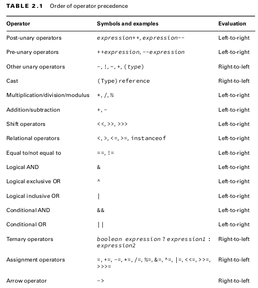
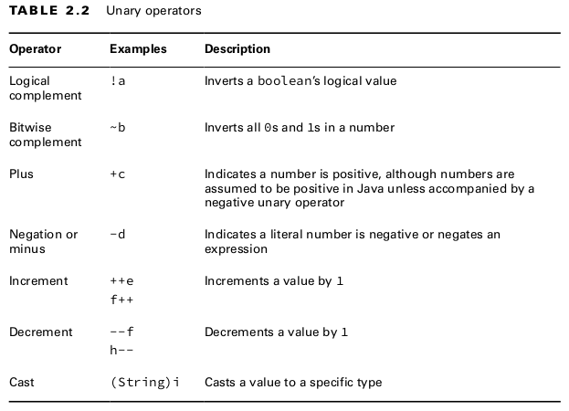
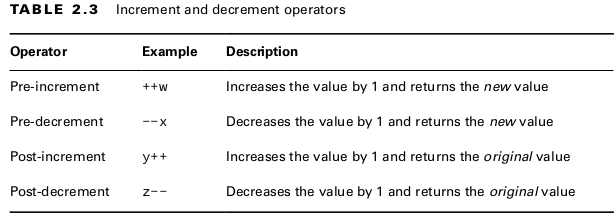
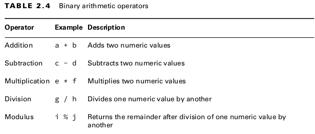

# 2. Chapter 2: Java operators

## 2.1. Understanding Java operators

- A Java **operator** is a special symbol that can be applied to a set of variables, values, or literals ­referred to as **operands** and that returns a result.
- Three types of operators: Unary, Binary, Ternary
[`Operator.java`](1_understanding_java_operators/Operator.java)
- operator precedence:-

- Arrow operator -> arrow function, lambda operator is a binary operator.

## 2.2. Unary operators

- equires exactly one operand, or variable, to function.
    1. Complement and Negation Operators
    2. Increment and Decrement Operators (arithmetic operators)
[`Unary.java`](2_unary_operators/Unary.java)

- in Java, **1** and **true** are not related in any way, just as **0** and **false** are not related.

## 2.3. Binary operators

- take two operands

### 2.3.1. Binary arithmetic operators

- operate on numeric values
- used to perform mathematical operations on variables, create logical expressions, and perform basic variable assignments
[`BinaryArithmetic.java`](3_binary_arithmetic_operators/BinaryArithmetic.java)

- All of the arithmetic operators may be applied to any Java primitives, with the exception of boolean. Furthermore, only the addition operators + and += may be applied to String values, which results in **String concatenation**.

- For integer values, division results in the floor value of the nearest integer that fulfills the operation, whereas modulus is the remainder value.

#### 2.3.1.1. Numeric Promotion 

- primitive numeric promotion, each primitive numeric type has a bit-­length
- 4 rules:
    1. If two values have different data types, Java will automatically promote one of the
    values to the larger of the two data types.
    2. If one of the values is integral and the other is floating-­point, Java will automatically
    promote the integral value to the floating-­point value’s data type.
    3. Smaller data types, namely, byte, short, and char, are first promoted to int any time
    they’re used with a Java binary arithmetic operator with a variable (as opposed to a
    value), even if neither of the operands is int. unary operators are excluded from this rule. For example, applying ++ to a short value results in a short value.
    4. After all promotion has occurred and the operands have the same data type, the result-
    ing value will have the same data type as its promoted operands.

## 2.4. Assigning Values

## 2.5.

## 2.6.

## 2.7. Questions

### 2.7.1. Review questions

- Q1

- Q2 

- Q3

- Q4

- Q5

- Q6 

- Q7

- Q8

- Q9

- Q10 

- Q11

- Q12

- Q13

- Q14

- Q15

- Q16

- Q17

- Q18

- Q19

- Q20

- Q21

### 2.7.2. Other questions

[`ThingExample.java`](OReilly/ThingExample.java)